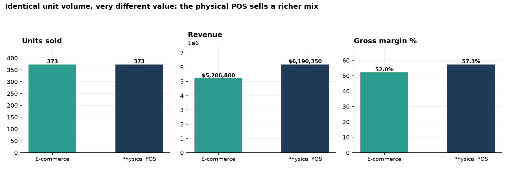
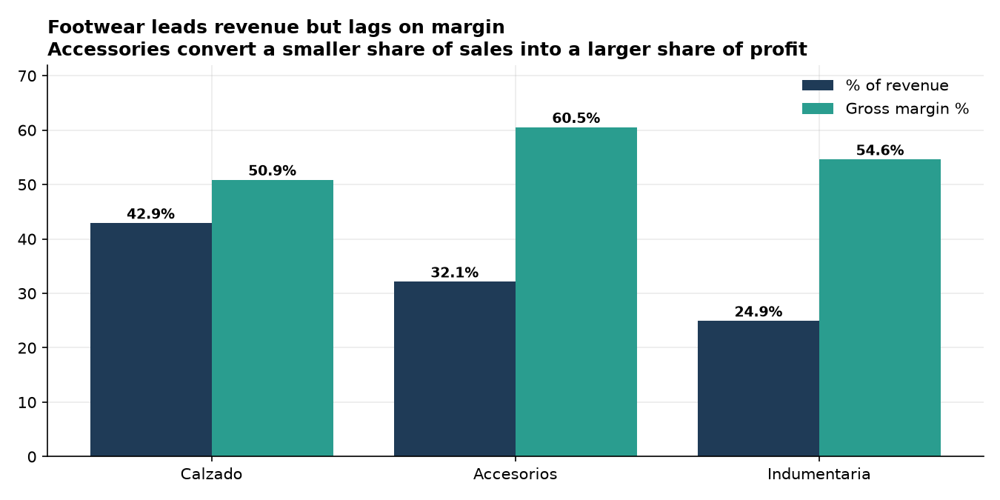
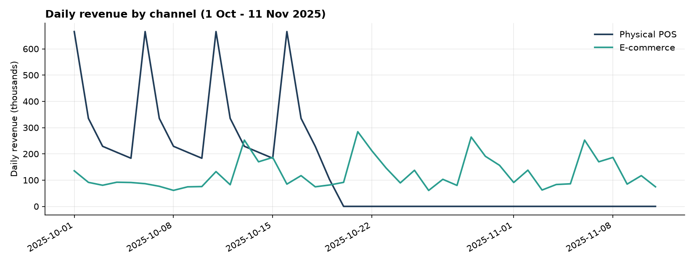

# Commercial Sales ETL Pipeline

An ETL pipeline that unifies sales from two channels — an online store and a physical point of
sale — enriches them with product cost data, and produces a formatted multi-sheet Excel report for
business users. Runs end to end in **1.1 seconds** with a single command.

**Headline finding:** both channels sold exactly the same number of units over the period, yet the
physical POS produced **18.9% more revenue and 5.3 percentage points more gross margin** — a
product-mix difference, not a traffic difference.

---

## Business findings

Period analysed: **1 Oct – 11 Nov 2025** · 42 days · 361 transactions · 40 products · 2 channels
Total revenue **$11,397,150** · gross margin **$6,257,650 (54.9%)**

### 1. Same volume, different value: the channels are not interchangeable



| | E-commerce | Physical POS |
|---|---:|---:|
| Units sold | 373 | 373 |
| Revenue | $5,206,800 | **$6,190,350** |
| Gross margin | 52.0% | **57.3%** |
| Average ticket | $27,696 | **$41,269** |

Identical unit volume, but the physical POS converts it into 18.9% more revenue at a materially
better margin. The gap is entirely product mix: in-store customers buy higher-priced,
higher-margin items.

**Recommendation:** the e-commerce problem is not traffic, it is basket composition. Cross-sell and
bundling on the online store should be tested before spending more on acquisition.

### 2. The category driving revenue is the one destroying margin



| Category | % of revenue | % of gross margin | Margin rate |
|---|---:|---:|---:|
| Calzado (footwear) | 42.9% | 39.8% | 50.9% |
| Accesorios (accessories) | 32.1% | **35.4%** | **60.5%** |
| Indumentaria (apparel) | 24.9% | 24.8% | 54.6% |

Footwear leads revenue but under-delivers on profit: it contributes 3.1 points less to margin than
to revenue. Accessories do the opposite, contributing 3.3 points more.

This holds at product level too. The single best-selling product — *Bota Urbana Cuero*, $1.08M —
has the **worst margin rate in the entire catalogue (49.1%)**. Four of the five lowest-margin
products with meaningful revenue are footwear.

**Recommendation:** footwear is functioning as a traffic driver, not a profit driver. Either
renegotiate footwear cost with suppliers or deliberately pair it with accessories at the point of
sale to lift blended basket margin.

### 3. Revenue is concentrated in a quarter of the catalogue

The **top 10 of 40 products generate 56.2% of revenue**, and the top 5 alone generate 35.3%.
Concentration this high means stock-outs on a handful of SKUs are a direct revenue risk.

**Recommendation:** apply a differentiated safety-stock policy to the top 10 rather than a flat
reorder rule across the catalogue.

### 4. Daily trend



---

## Architecture

```
data/raw/productos.xlsx           data/raw/ventas_ecommerce.xlsx   data/raw/ventas_local.xlsx
        |                                    |                              |
        +------------------------------------+------------------------------+
                                             |
                                             v
                                        extract.py     path config, per-file validation
                                             |
                                             v
                                       transform.py    channel unification, product join,
                                             |         margin calculation, KPI tables
                                             v
                                          load.py      formatted multi-sheet Excel
                                             |
                                             v
                              output/reporte_ventas_semanal.xlsx
```

`pipeline.py` orchestrates the three stages, with timing and structured logging to both stdout and
a dated log file.

## Design decisions

- **Channel unification before enrichment.** E-commerce and POS files have different schemas
  (`id_pedido`/`ciudad`/`estado_pedido` vs `id_ticket`/`sucursal`/`cajero`/`hora`). Both are mapped
  to a common `id_documento` + `canal` model first, so every downstream metric is channel-agnostic
  and new channels can be added without touching the KPI code.
- **Margin computed in the pipeline, not in Excel.** Joining product cost at transform time means
  the margin definition lives in version control instead of in a spreadsheet formula that nobody
  can audit.
- **Raw sheet preserved in the output.** The report ships the unified raw data alongside the clean
  data so a business user can trace any KPI back to source rows.
- **Structured logging with row counts at every stage.** Each stage logs what it read and what it
  produced, which is what makes a silent row-loss regression visible.

## Tech stack

Python 3.13 · pandas · openpyxl · python-dotenv · matplotlib

## How to run

```bash
git clone https://github.com/rivaslucianoivan/data-pipeline-commercial-sales.git
cd data-pipeline-commercial-sales
python -m venv .venv
.venv/Scripts/activate          # Windows -- use: source .venv/bin/activate on macOS/Linux
pip install -r requirements.txt
python -m src.pipeline
```

The report is written to `output/reporte_ventas_semanal.xlsx`.

Regenerate the figures in this README:

```bash
python reports/make_figures.py
```

## Output

`output/reporte_ventas_semanal.xlsx`, with frozen headers, auto-filters and auto-sized columns on
every sheet:

| Sheet | Content |
|---|---|
| `raw` | unified transactions before enrichment |
| `clean` | enriched transactions with cost, margin and date parts |
| `kpi_resumen_diario` | revenue, margin and units per day and channel |
| `kpi_por_categoria` | performance by product category |
| `kpi_top_productos` | 10 best-selling products by revenue |
| `tbl_tabla_dia_canal` | pivot: day x channel |
| `tbl_tabla_categoria_canal` | pivot: category x channel |

## Project structure

```
data-pipeline-commercial-sales/
├── data/raw/               # source files: products, e-commerce sales, POS sales
├── output/                 # generated Excel report
├── reports/
│   ├── figures/            # PNGs used in this README
│   └── make_figures.py     # reproduces the figures above
├── src/
│   ├── extract.py          # path config + file readers + validation
│   ├── transform.py        # channel unification, enrichment, KPI tables
│   ├── load.py             # Excel writer with formatting
│   └── pipeline.py         # orchestrator with logging and timing
├── requirements.txt
└── README.md
```

## Author

**Luciano Iván Rivas** — Data Analyst

[GitHub](https://github.com/rivaslucianoivan) · [novalandingtec.com](https://novalandingtec.com)
